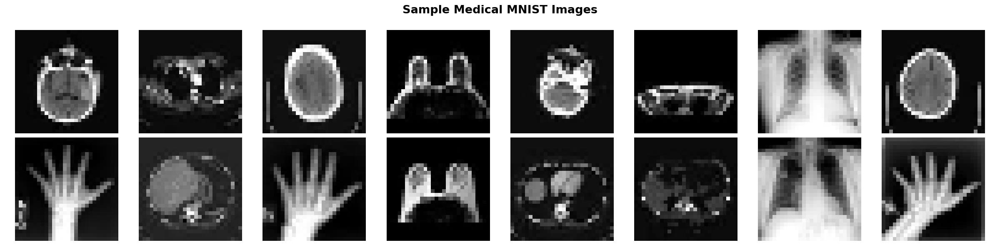
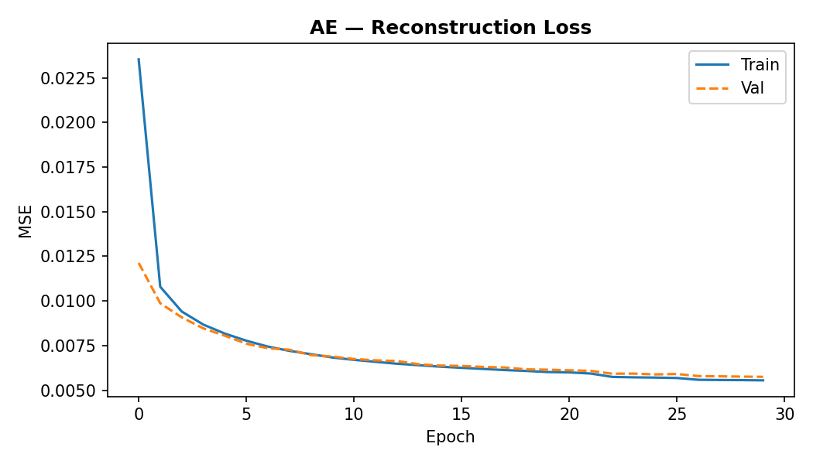
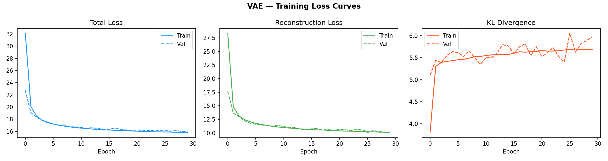
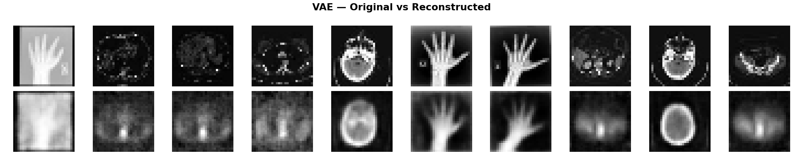
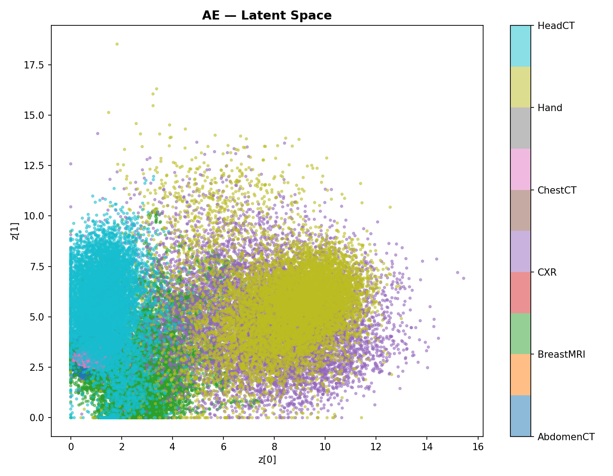
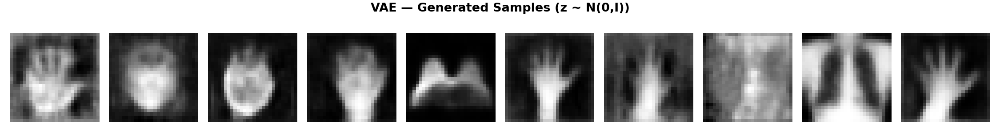
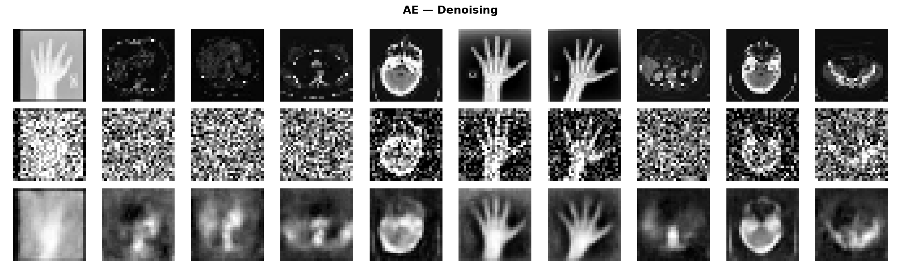
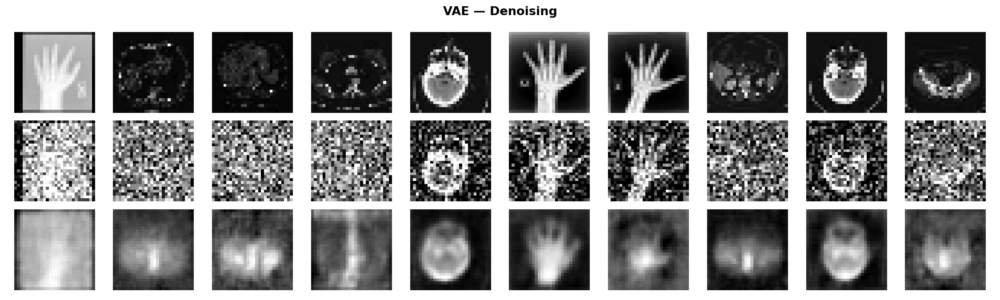

# Representation Learning with AE & VAE

> **Course:** Generative AI — Selected Topics in DSAI  
> **Institution:** Zewail City of Science and Technology  
> **Dataset:** [Medical MNIST](https://www.kaggle.com/datasets/andrewmvd/medical-mnist) — 58,954 grayscale medical images across 6 classes

---

## Project Structure

```
Assignment One Gans/
├── data/
│   ├── raw/
│   │   ├── AbdomenCT/
│   │   ├── BreastMRI/
│   │   ├── ChestCT/
│   │   ├── CXR/
│   │   ├── Hand/
│   │   └── HeadCT/
│   └── processed/
├── models/
│   ├── ae_weights.weights.h5
│   ├── vae_weights.weights.h5
│   ├── ae_loss.png
│   ├── ae_reconstructions.png
│   ├── ae_latent_space.png
│   ├── ae_denoising.png
│   ├── vae_loss.png
│   ├── vae_reconstructions.png
│   ├── vae_latent_space.png
│   ├── vae_generated.png
│   └── vae_denoising.png
├── notebooks/
│   └── experiment.py
├── src/
│   ├── __init__.py
│   ├── data_processing.py
│   ├── model.py
│   └── train.py
├── tests/
│   ├── test_data_processing.py
│   └── test_model.py
├── README.md
└── requirements.txt
```

---

## Setup & Installation

### 1. Clone the repository
```bash
git clone https://github.com/YOUR_USERNAME/dsai490-assignment1.git
cd dsai490-assignment1
```

### 2. Create and activate Conda environment
```bash
conda create -n Assignment_Gans python=3.10 -y
conda activate Assignment_Gans
pip install -r requirements.txt
```

### 3. Download the dataset
Download [Medical MNIST](https://www.kaggle.com/datasets/andrewmvd/medical-mnist) from Kaggle and extract the 6 class folders into `data/raw/`:
```
data/raw/AbdomenCT/
data/raw/BreastMRI/
data/raw/ChestCT/
data/raw/CXR/
data/raw/Hand/
data/raw/HeadCT/
```

---

## Running the Project

### Run tests (verify everything works)
```bash
pytest tests/ -v
```
Expected: **21 passed**

### Run the full experiment
```bash
python notebooks/experiment.py
```

All outputs (plots + weights) are saved automatically to `models/`.

---

## Dataset

The Medical MNIST dataset contains **58,954 grayscale images** (28×28 pixels) across 6 medical imaging classes:

| Class | Description |
|---|---|
| AbdomenCT | Abdominal CT scans |
| BreastMRI | Breast MRI scans |
| ChestCT | Chest CT scans |
| CXR | Chest X-rays |
| Hand | Hand X-rays |
| HeadCT | Head CT scans |

**Sample images from the dataset:**



---

## Model Architectures

### Autoencoder (AE)

| Component | Layer | Output Shape |
|---|---|---|
| **Encoder** | Input | (28, 28, 1) |
| | Conv2D(32, 3, stride=2) + ReLU | (14, 14, 32) |
| | Conv2D(64, 3, stride=2) + ReLU | (7, 7, 64) |
| | Flatten → Dense(16) + ReLU | (16,) |
| **Decoder** | Dense(7×7×64) + ReLU | (3136,) |
| | Reshape → ConvT(64, stride=2) + ReLU | (14, 14, 64) |
| | ConvT(32, stride=2) + ReLU | (28, 28, 32) |
| | ConvT(1) + Sigmoid | (28, 28, 1) |

**Loss:** Mean Squared Error (MSE)

### Variational Autoencoder (VAE)

Same encoder/decoder backbone as AE, with the following additions:

| Addition | Detail |
|---|---|
| Dense(128) hidden layer | Extra capacity before latent heads |
| `z_mean` head | Dense(16) — mean of latent distribution |
| `z_log_var` head | Dense(16) — log variance of latent distribution |
| Reparameterization | `z = z_mean + ε · exp(0.5 · z_log_var)`, ε ~ N(0,I) |

**Loss:** Reconstruction Loss (MSE) + KL Divergence  
```
Total Loss = Σ(x - x̂)² + (-0.5 · Σ(1 + log_var - mean² - exp(log_var)))
```

---

## Results

### AE — Training Loss

The AE reconstruction loss drops sharply in the first 5 epochs and converges smoothly. Train and validation curves track closely — no overfitting.



### VAE — Training Loss Curves

The VAE shows three tracked losses. The reconstruction loss decreases steadily while the KL divergence rises quickly then stabilises around 5.5 — indicating the model has found a balance between reconstruction accuracy and a well-regularised latent space.



---

### VAE — Reconstruction Quality

The VAE captures the overall shape and structure of each image type. Reconstructions are slightly smoother than AE due to the probabilistic latent space regularisation.



---

### Latent Space Visualization

The AE latent space (first 2 dimensions of 16) shows partial class separation — HeadCT (cyan) and Hand (yellow-green) occupy distinct regions, while CT scan types overlap due to visual similarity. The axes are unbounded since AE imposes no distribution constraint on the latent space.



> **Key insight:** AE latent space is unregularised — clusters exist but are scattered across arbitrary coordinate ranges (0–16). This makes random sampling from the latent space unreliable for generation.

---

### VAE — Generated Samples

By sampling `z ~ N(0, I)` and decoding, the VAE produces new medical images that were never seen during training. The generated samples show recognisable anatomical structures — hands, circular scan shapes, and X-ray-like patterns.



> This is only possible with the VAE — the AE cannot generate new samples because its latent space has no defined structure to sample from.

---

### Denoising

Both models were tested by adding Gaussian noise (factor=0.3) to the inputs. The models reconstruct the clean image from the corrupted input.

**AE Denoising** — sharp detail recovery:



**VAE Denoising** — smoother recovery:



---

## AE vs VAE Comparison

| Aspect | AE | VAE |
|---|---|---|
| Latent space | Deterministic, unstructured | Probabilistic, N(0,I) regularised |
| Reconstruction | Slightly sharper (lower MSE) | Slightly smoother |
| Generation | Cannot generate new samples | Generates new samples via z ~ N(0,I) |
| Latent space structure | Arbitrary clusters | Continuous, overlapping clusters |
| Loss function | MSE only | MSE + KL Divergence |
| Denoising | Strong | Strong (slightly smoother output) |
| Use case | Compression, denoising | Generation, interpolation, representation |

---

## Key Findings

**1. AE reconstructs more sharply** — without the KL regularisation penalty, the AE encoder can use the full capacity of the latent space to memorise fine details, leading to lower MSE.

**2. VAE latent space is structured** — the KL divergence term forces the learned distribution toward N(0,I). This is what enables meaningful interpolation and generation, but comes at the cost of slightly blurrier reconstructions.

**3. KL divergence stabilises** — after a sharp rise in the first 2 epochs, the KL loss plateaus around 5.5, showing the model reached an equilibrium between reconstruction quality and latent space regularity.

**4. Both models denoise effectively** — even with 30% Gaussian noise, both AE and VAE recover the general structure of the image, demonstrating the robustness of the bottleneck architecture.

**5. Latent space clusters reflect visual similarity** — CT scan classes (AbdomenCT, ChestCT, HeadCT) overlap in the latent space because they share similar circular bright-on-dark visual structure. Hand X-rays and CXR images are more distinct.

---

## Requirements

```
tensorflow>=2.13.0
numpy>=1.23.0
matplotlib>=3.7.0
pytest>=7.0.0
```

Install with:
```bash
pip install -r requirements.txt
```

---

## References

- [TensorFlow Autoencoder Tutorial](https://www.tensorflow.org/tutorials/generative/autoencoder)
- [TensorFlow CVAE Tutorial](https://www.tensorflow.org/tutorials/generative/cvae)
- [AE vs VAE — Medium](https://medium.com/data-science/difference-between-autoencoder-ae-and-variational-autoencoder-vae-ed7be1c038f2)
- [Medical MNIST Dataset](https://www.kaggle.com/datasets/andrewmvd/medical-mnist)